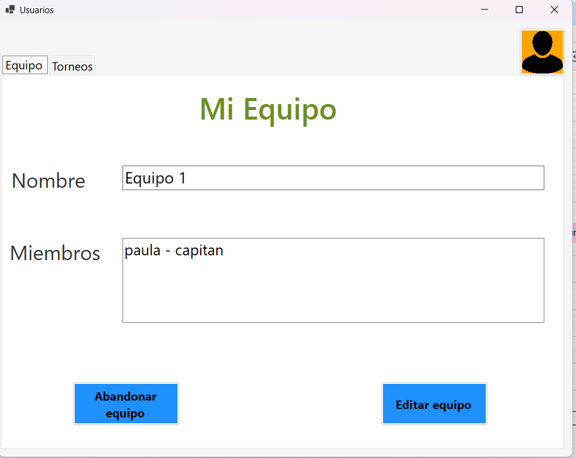
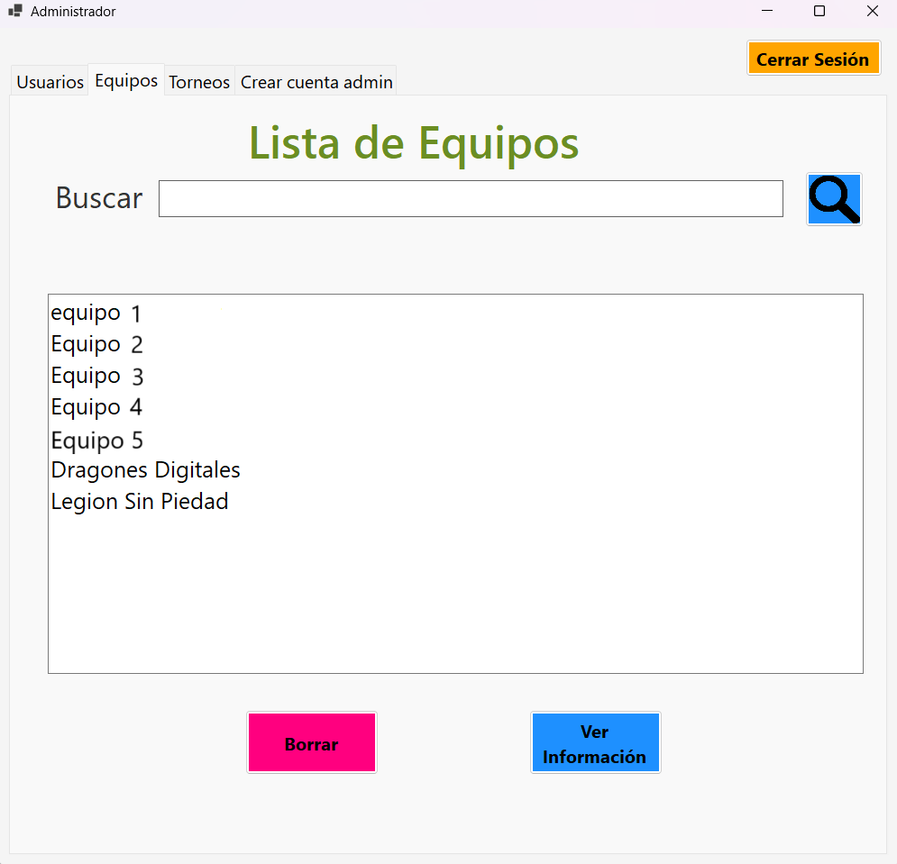
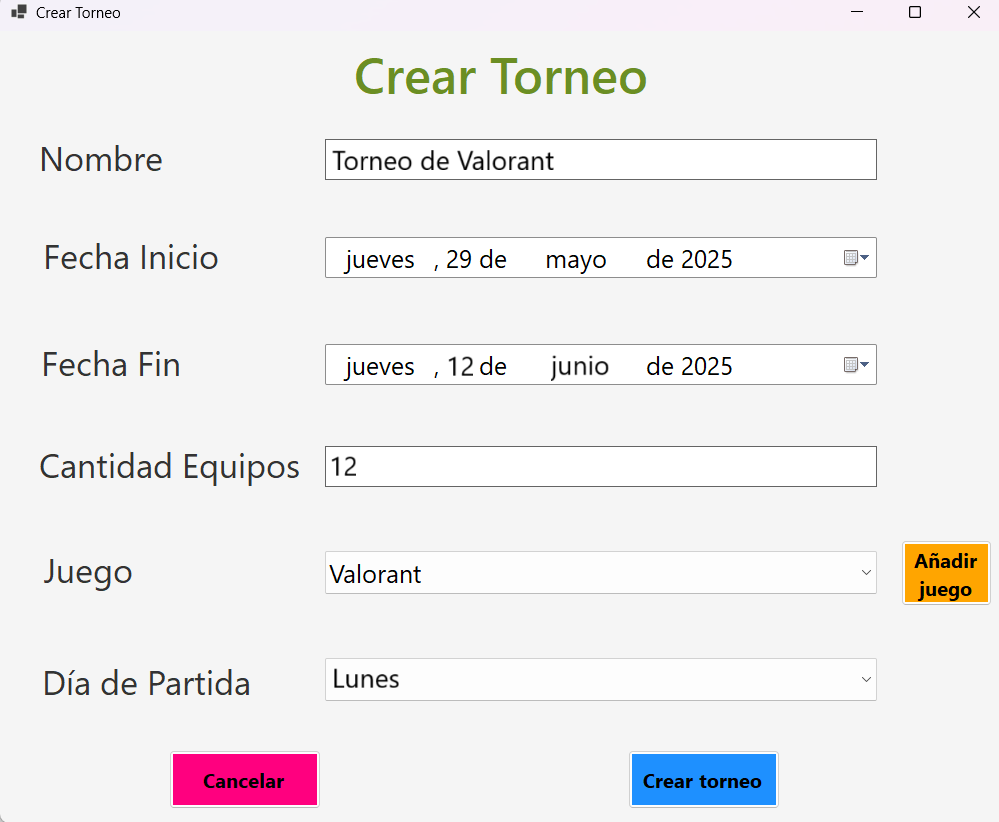
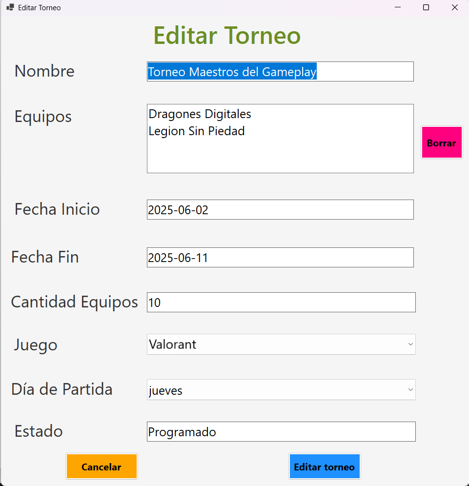

# App de Gestión de Equipos y Torneos de Videojuegos

Proyecto Final de Grado del ciclo formativo de Desarrollo de Aplicaciones Multiplataforma.

## Descripción
Aplicación multiplataforma destinada a la gestión de equipos de videojuegos.  
Permite crear y administrar equipos, torneos y registrar resultados de forma organizada y sencilla.

## Funcionalidades
- Creación y gestión de equipos
- Administración de torneos
- Registro de resultados
- Gestión de datos mediante base de datos

## Tecnologías utilizadas
- C#
- MySQL

## Contexto del proyecto
Este proyecto ha sido desarrollado como Trabajo de Fin de Grado (TFG) del ciclo de Desarrollo de Aplicaciones Multiplataforma.

## Estado del proyecto
Proyecto finalizado.

## Capturas de pantalla
### Pantalla principal del usuario

### Perfil del usuario

### Gestión de equipos

### Crear torneo

### Editar torneo

## Documentación
[📄 Manual de usuario (PDF)](docs/manual-usuario.pdf)
